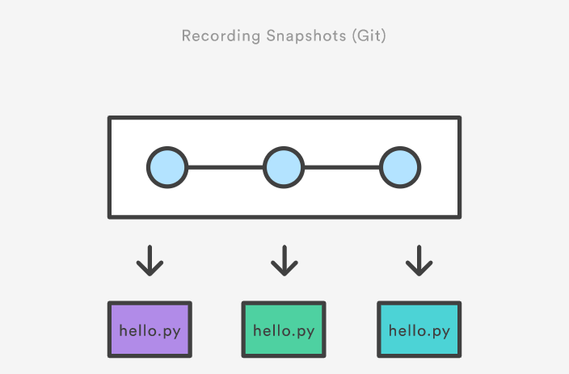
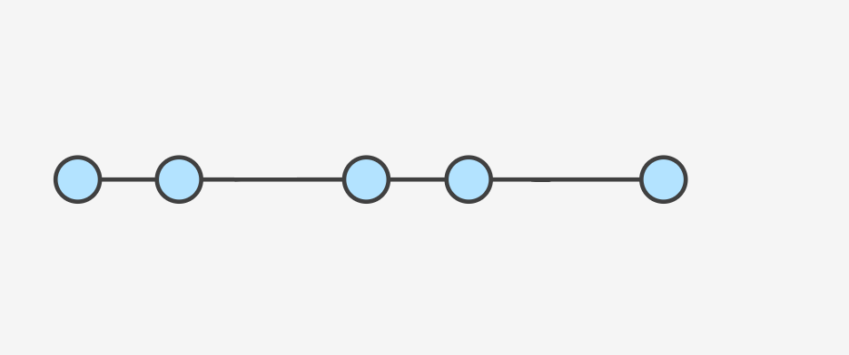

# Konular

- [Versiyon Nedir?](#1-versiyon-nedir)
- [Versiyon Nasıl Kontrol Edilir?](#2-versiyon-nasıl-kontrol-edilir)
- [Versiyonları Kontrol Etmeye Neden İhtiyacımız Var?](#3-versiyonları-kontrol-etmeye-neden-i̇htiyacımız-var)
- [Init](#init)
- [Status](#status)
- [Add](#add)
- [Restore](#restore)
- [Gitignore](#gitignore)
- [Config](#config)
- [Commit](#commit)
- [Log](#log)
- [Tag](#tag)
- [Reset](#reset)
- [Revert](#revert)
- [Branch](#branch)
- [Checkout ve Switch](#checkout-ve-switch)
- [Diff](#diff)
- [Merge](#merge)
- [Rebase](#rebase)
- [Remote](#remote)
- [Clone](#clone)
- [Pull](#pull)
- [Push](#push)
- [Git Workflow](#git-workflow)
- [Kaynakça](#kaynakça)

# [Versiyon Kontrolü](https://biproberkay.gitbook.io/versiyon-kontrolue-egitimi/ "# Versiyon Kontrolü")

​​

## 1. Versiyon Nedir?
“İster kıdemli bir yazılım geliştirici olun isterseniz yazılım geliştirme işine yeni başlayan bir profesyonel; iş görüşmelerinde

temel bilgisayar bilimleri,

programlama dilleri ve

veri tabanları

ile ilgili sorulardan sonra ilk 5 soru içinde yer alacak konulardan birisi de Git olacaktır.” (Özgür, n.d., 1)

“Dosyaların kayıt altına alınmış herhangi bir andaki hallerine versiyon diyoruz” (Özgür, n.d.)

​
## 2. Versiyon Nasıl Kontrol Edilir?
Projelerinizde çalışmalarınız kayda değer seviyede gelişme gösterdiği anda bu başarınızı kayıt etmek yani saklamak istersiniz. Çalışma alanınıza geçtiğiniz her bir zaman diliminde, emeklerinizin meyvesi olan, dosyalarınızı veya materyallerinizi bir sonraki çalışmanıza kadar güvende kalacak şekilde kaydedersiniz.

Kopya oluşturma yöntemi. İlk akla gelen yöntem sanırım dosyalarınızın bir kopyasını oluşturup yedeklemek olur. Bunu ara ara yaparak yedeklerinizin de güncel kalmasını sağlarsınız. Ne zaman yedekleme yapacağınıza da sanırım önemli bir aşamaya geldiğinizi düşündüğünüz anda karar verirsiniz.

**Siz projelerinizi nasıl versiyonluyorsunuz?**``

Böylelikle proje klasörünüzün bir sürü kopya klasörü olacaktır. Zamanla bu klasörleri yönetmenin zorluğunu çekmeye başlayacaksınız. Neyse ki Bilgisayar bilimine gönül vermiş bilim adamları ve yazılım geliştiricileri ile paraya gönül vermiş birtakım yazılım ve bilişim şirketleri bizim için versiyonlarımızı kontrol edebileceğimiz yazılımlar geliştirmişlerdir.

## 3. Versiyonları Kontrol Etmeye Neden İhtiyacımız Var?
### 1. Kitap Baskıları Örneği
Yayınevleri kitapları baskı adı verilen sürümler yani versiyonlar halinde matbaadan çıkarır ve müşterilerine sunulmak üzere mağazalara gönderir. aldığınız kitapların hepsinde baskı numarası ve tarihi olur. En çok baskıya ulaşan yazarlar bununla övünürler.

### 2. Projelerinizde kopyalar oluşturma ihtiyacınız oluyor mu?

yukarıdaki örnekte olduğu gibi; eğer siz de projelerinizi kopya klasörlerle versiyonlama işlemine tabi tutuyorsanız. Versiyon kontrol yazılımları size ihtiyacınız olan çözümleri sunan gayet işlevsel bir araç olacaktır.

versiyonları belirli aralıklarla kaydetme örneği

Teknolojinin tanımını gelin beraber yeniden yapalım. İnsan emeği ile yapılan manuel işlemleri düşünün. Genellikle bir döngü oluştururlar. Bu durumu gören akıllı kişiler olur. Kimi zaman mucit, kimi zaman bilim adamı, kimi zaman da girişimci, olarak adlandırabiliriz bu kişileri. İnsan emeği değerlidir ama nispeten daha yavaştır.Makine emeği ise insan emeğine göre çok daha hızlıdır. Akıllı kişilerin makine emeğini kullanmak için makinelere yapacağı işlerin talimatlarının sıralandığı bir bilgi taşıyan dosyalara yazılım diyoruz. Böylelikle manuel olan işlerinizi sizin için otomatize ederek daha fazla verim alabiliyorsunuz. İşte buna teknoloji denir. Versiyonlama teknolojisi ise sizi “kopyala-yapıştır”lardan kurtaran harika bir teknolojidir.

### 3. Versiyonların düzgün bir şekilde takip edilebilmesi
Üzerinde çalıştığınız bir dosyanın veya bir dizi proje dosyasının zaman içinde farklı versiyonları oluşur ve bu versiyonların kayıt altına alınması gerekir. Bu sorumluluk genelde çok zahmetli ve sıkıcı bir iş ve süreçtir. Aşağıdakine benzer sorular canınızı gereğinden fazla sıkabilir

Sadece değişen dosyalar mı yoksa bir projedeki tüm dosyaların versiyonları mı kaydedilmeli?

Bir sürü dosya içinden sadece değişen dosyaların belirlenmesi zordur

Her seferinde dosyaların hepsinin teker teker kaydedilmesi durumunda ise ihtiyaç duyulandan daha fazla disk alanı kullanılır

Dosyalara verilecek isimler tam bir baş ağrısına dönüşebilir.

Personel_Maas.xlsx

Personel_Maas1.xlsx

Personel_Maas_Ozet.xlsx

Personel_Maas_BrutHaricDetay.xlsx şeklinde dosya isimleri üretmek zorunda kalabilirsiniz.

Belki de canınızı en çok sıkacak şey projenizin iki versiyonu arasında tam olarak ne tür farkların olduğunu sağlıklı bir şekilde bilme şansınız olmaması olacaktır

Versiyon kontrol sistemi kullandığınızda sizin çalıştığınız disk alanında proje dosyalarının sadece bir versiyonu bulunur, bu dosyaların daha önceki halleri versiyon kontrol sisteminin denetimindedir. Bu sayede istediğiniz zaman önceki versiyonlara geri dönebilir, versiyonlar arasındaki farklılıkları rahatlıkla inceleyebilir ve versiyonları kaydederken eklediğiniz ilave bilgileri ve yorumlarınızı rahatlıkla görebilirsiniz. (Özgür, n.d.,)

### 4. Geri dönme
Dosyalarınızın veya aslında tüm projenizin daha önceki versiyonuna geri dönebilme imkanın size ciddi anlamda özgürlük sağlar; dosyalarınızı ve projenizi istediğiniz gibi değiştirme özgürlüğü. Yaptığınız değişiklikler projenizi çöpe döndürdüyse, geliştirdiğiniz bir işlev tam istediğiniz gibi olmadıysa veya müşteriniz veya patronunuz geliştirdiğiniz bir işlevi artık istemediğine karar verirse projenizin önceki temiz haline çok hızlı ve rahat bir şekilde dönebilirsiniz.

### 5. Farklı yaklaşımlar deneme
Branch özelliği size bir projede farklı karar alternatiflerini deneme olanağı tanır. Böylelikle verdiğiniz kararların hiçbiri geri dönülemez kararlar olmaz.

​
4. Versiyon Kontrol Sistemleri neler?
​([2])

Bize tanıdık gelenler neler bir bakalım!

-----------------

# Git Komutları

### Init
*git init* komutu git yapılandırmasını dahil eder.
### Kullanım
    $ git init
    
-----------------

### Status
*git status* komutu git kullanarak takip edilen dizindeki dosyaların değişikliklerini listeler.
### Kullanım
    $ git status
    $ git status -s

-----------------

### Add
*git add* komutu değişiklik yaptığımız dosyaları commit edilmek üzere 'stage' alanına eklememizi sağlar.

### Kullanım
    $ git add .
    $ git add <file-name>
    $ git add <file-path>
    
-----------------

### Restore
*git restore* komutu değişiklik yaptığımız dosyanın değişikliklerini geri almak için kullanılır.
### Kullanım
    $ git restore <file-name>
    $ git restore --staged <file-name>

-----------------

### Gitignore
*.gitignore* dosyasına dizindeki istemediğimiz veya gerek duymadığımız dosyaları ekleyerek git'e gönderilmesini ve değişikliklerin takip edilmeini engellemiş oluruz.
### Kullanım
    $ touch .gitignore
    $ nano .gitignore
    $ git status

-----------------

### Config
*git config* komutu git ile alakalı yapılandırmaları belirlemek için kullanılır.
### Kullanım
    $ git config --global user.name "ad soyad"
    $ git config --global user.email "ornek@mail.com"
    $ git config --list

-----------------

### Commit
*git commit* komutu dosyaların o anki durumunu kaydeder ve bir referans noktası oluşturur. Proje ilerledikten sonra isterseniz commit ettiğiniz başka bir noktaya geri dönüş yapmanızı sağlar.

### Kullanım
    $ git commit -m 'this is commit message'
    $ git commit -a -m 'mesaj'
    $ git commit --amend -m 'edited commit message'

-----------------

### Log
*git log* komutu yapmış olduğumuz commit'leri listeler.
### Kullanım
    $ git log
    $ git log --oneline --all --decorate --graph
    $ git config --global alias.lo 'log --all --graph --decorate --oneline'

-----------------

### Tag
*git tag* komutu belirlediğimiz bir commit'i işaret eden referanslardır. 

### Kullanım
    $ git tag --list
    $ git tag <tag-name> 
    $ git tag <tag-name> <commit-hash>
    $ git tag <tag-name> -m 'tag message'
    $ git show <tag-name>
    $ git tag --delete <tag-name>

-----------------

### Reset
*git reset* komutu bulunduğumuz branch ile ilerideki veya gerideki bir commit'e gitmeyi sağlar.

### Kullanım 
    $ git reset <commit-hash>
    $ git reset --soft HEAD~1
    $ git reset --hard HEAD~3
    $ git reflog

-----------------

### Revert
*git revert* komutu bir commit'te yaptığımız değişiklikleri iptal edip bu işlemi yaptığınıza dair yeni bir commit oluşturur.

### Kullanım
    $ git revert <commit-hash>

-----------------

### Branch
*git branch* bir projede dallanmayı sağlar. Bir projede birden fazla kişi çalışırken kullanılması gerekir.

### Kullanım
    $ git branch <new_branch>
    $ git checkout <new_branch>
    $ git branch -d <branch-name>
    $ git branch -M <new_branch>

-----------------

### Checkout ve Switch
*git checkout* komutu branch'ler arasında geçiş yapmamızı ve istediğimiz bir commit'e gidip dosyaların o anki durumunu görmemizi sağlar.

### Kullanım
    $ git checkout <commit-hash>
    $ git checkout <branch-name>
    $ git switch <branch-name>

-----------------

### Diff
*git diff* komutu bir dosyadaki farklılıkları görmek için kullanılır.
### Kullanım
    $ git diff
    $ git diff <file-name>
    $ git diff <commit-hash> <commit-hash>
    $ git diff <branch-name> <branch-name>
    $ git diff <branch-name> <branch-name> <file-name>

-----------------

### Merge
*git merge* komutu branchleri birleştirmek için kullanılır. Conflict meydana geldiğinde bunun çözülmesi kullanıcının sorumluluğundadır.

### Kullanım
    $ git merge <branch-name>
    $ git merge --continue
    $ git merge --abort

-----------------

### Rebase
*git rebase* komutunu kullandığımızda A branchindeki her bir commit B dalına sanki commit işlemi B dalında yapılmış gibi yeniden yazılır.

### Kullanım
    $ git rebase <branch-name>

-----------------

### Remote
*git remote* yerel depo ile takip edilen uzak depoyu kontrol edebilmeyi sağlar.

### Kullanım
    $ git remote -v 
    $ git remote add <remote-name> <remote-url>
    $ git remote remove <remote-name>
    $ git remote set-url origin git@github.com:USERNAME/REPOSITORY.git

-----------------

### Clone
*git clone* Github'da varolan bir depoyu tüm dosyalar, dallar dahil olmak üzere klonlar(indirir).
### Kullanım
    $ git clone <remote-url>

-----------------

### Pull
*git pull* içerisinde bulunulan branch'in remote reposundaki değişikler ile bütün commitleri alarak günceller.
### Kullanım
    $ git pull
    $ git pull --rebase
    $ git pull --force
    $ git pull --all

-----------------

### Push
*git push* lokal branchteki commitleri remote repoya yükler.
### Kullanım
    $ git push -u <remote-name> <branch-name>
    $ git push --all
    $ git push --tags
    
-----------------

### Git Workflow

-----------------

### Kaynakça
- https://www.atlassian.com/git/tutorials
- https://www.youtube.com/playlist?list=PLkEZWD8wbltmcZQaA0ism9k2E6MGRnHZ7
- https://www.youtube.com/watch?v=mYjZtU1-u9Y&list=PL1F56EA413018EEE1
- https://www.youtube.com/watch?v=jLWZaFzPS6Q
- https://www.youtube.com/watch?v=oFYyTZwMyAg
- https://www.youtube.com/watch?v=BF2OHMM86Ik
- https://www.youtube.com/watch?v=k5D37W6h56o
- https://www.youtube.com/watch?v=jhtbhSpV5YA
- https://www.youtube.com/watch?v=vIp3Uz4DG2c
- https://www.youtube.com/watch?v=1SXpE08hvGs
- https://www.youtube.com/watch?v=aJnFGMclhU8
- https://www.youtube.com/watch?v=ww4xpcvzLHc
- Özgür, Ali. n.d. Git ile Versiyon Kontrolü. N.p.: Dikey Eksen. https://www.dikeyeksen.com/products/git-ile-versiyon-kontrolu
- Özgür, Ali. n.d. “Türkçe Git 101.” gitbook. https://aliozgur.gitbooks.io/git101/content/.``

